# 경기도 카드 소비 데이터로 알아보는 소비 패턴과 트렌드

프로젝트 github 주소 : [https://github.com/davidots429/GyeonggiCard2025](https://github.com/davidots429/GyeonggiCard2025)

보고서에서는 전체적인 로직을 확인할 수 있는 정도만 코드를 작성했다. (전체 코드는 github에)

## 1. 데이터 수집

022년 01월 ~ 2025년 09월의 경기도 카드 소비 데이터를 경기데이터드림에서 다운로드 받아서 사용했다. 모든 데이터는 전수화 보정이 되어 있는 상태였다.

경기도 카드 소비 데이터 : https://data.gg.go.kr/portal/data/service/selectServicePage.do?page=1&rows=10&sortColumn=&sortDirection=&infId=7Y02TF04H1WUB55Q4IZL35052374&infSeq=2&order=&loc=

다운로드 받은 파일이 tbsh_gyeonggi_day_202501_광명시.csv 같은 형식의 파일이 450개정도 있는 식이어서 데이터를 먼저 병합하기로 했다.

## 2. 데이터 전처리
아래와 같은 코드로 다운로드 받은 파일들을 불러오고 이미 병합한 파일이 있는지 확인한다.
```python 
# 핵심 부분인 2줄만 작성함.

csv_files = sorted([f for f in all_files if f.startswith('tbsh_gyeonggi_day_') 
    and f.endswith('.csv')])

exist_files = sorted([f for f in os.listdir(DATA_OUTPUT_DIR) if f.startswith('gyeonggi_')
    and f.endswith('.csv')])
```

월별로 csv 파일을 병합한다. 파일의 인코딩이 월별로 달라 에러가 발생했고 아래와 같은 코드로 해결했다.
```python
for month in sorted(target_months):
    month_files = monthly_files[month]
    dfs = []
    
    # 인코딩 관련 에러 해결 코드
    for filename in month_files:
        filepath = os.path.join(DATA_RAW_DIR, filename)
        df_temp = None
        for encoding in ['utf-8', 'euc-kr', 'cp949']:
            try:
                df_temp = pd.read_csv(filepath, encoding=encoding)
                break
            except:
                continue
        if df_temp is not None:
            dfs.append(df_temp)
    
    if len(dfs) > 0:
        df_month = pd.concat(dfs, ignore_index=True)
        output_file = os.path.join(DATA_OUTPUT_DIR, f"gyeonggi_{month}.csv")
        df_month.to_csv(output_file, index=False)
        success_count += 1
```

숫자 데이터에서 0 값을 찾는 함수를 포함한 여러 함수를 정의했다.
```python
# 데이터에서 이상치를 발견한 함수만 적음.
def df_zero(df, columns=None):
    zeros = {}
    if columns is None:
        columns = df.select_dtypes(include=[np.number]).columns
    for col in columns:
        count = (df[col] == 0).sum()
        if count > 0:
            zeros[col] = {
                'count' : count,
                'percentage' : (count/len(df))*100
            }
    
    return zeros
```

병합 파일에서 결측치 및 이상치를 찾고 결과를 csv파일로 저장한다.
```python
for filename in processed_files:
    month = filename.replace('gyeonggi_', '').replace('.csv', '')
    
    try:
        # 선언 및 함수 활용 생략
        search_results.append(search_report)

# 선언 생략
summary_df = pd.DataFrame(summary_data)
csv_output = os.path.join(ANALYSIS_OUTPUT_DIR, 'searching_summary.csv')
summary_df.to_csv(csv_output, index=False, encoding='utf-8-sig')
```

결과를 확인한다.
```python
summary_df = pd.read_csv(os.path.join(ANALYSIS_OUTPUT_DIR, 'searching_summary.csv'))
summary_df.head()
```

|   | month  | total_rows | missing_count | duplicate_count | negative_count | zero_count |
|---|-------:|-----------:|--------------:|----------------:|---------------:|-----------:|
| 0 | 202201 | 11479842   | 0             | 0               | 0              | 89         |
| 1 | 202202 | 10191338   | 0             | 0               | 0              | 76         |
| 2 | 202203 | 12106986   | 0             | 0               | 0              | 115        |
| 3 | 202204 | 12500585   | 0             | 0               | 0              | 148        |
| 4 | 202205 | 13218383   | 0             | 0               | 0              | 153        |

아래와 같은 코드로 0값을 제거한다.
```python
for month in drop_target_month:
    file_path = os.path.join(DATA_OUTPUT_DIR, f'gyeonggi_{month}.csv')
    try:
        df = pd.read_csv(file_path)
        rows_before = len(df)

        for col in df.select_dtypes(include=[np.number]).columns:
            df = df[df[col] != 0] 

        rows_after = len(df)
        removed_rows = rows_before - rows_after
        df.to_csv(file_path, index=False, encoding='utf-8-sig') 
        processed_count += 1
```

## 3. 데이터 샘플링 

표준 점수는 신뢰도에서 평균을 뺀 값을 표준편차로 나눈 값이다.


scipy을 사용해서 아래와 같은 방식으로 구할 수 있다.
```python
z_score = stats.norm.ppf((1 - confidence_level) / 2)
```
모집단의 크기가 무한이라고 가정하면 샘플의 크기는 다음과 같다.


그러나 모집단의 크기가 매우 커도 무한이 아니기 때문에 유한 수정계수를 적용해야 한다.


다음과 같은 코드로 샘플링 비율을 구할 수 있다.
```python
n = (z_score**2 * p * (1-p)) / (margin_error**2)
min_sample_size = math.ceil(n / (1 + ((n - 1) / population_size)))
sampling_ratio = (n / population_size) * 100
```
5% > 0.003% 이므로 샘플 크기를 5%로 잡아도 통계적 왜곡이 없다는 사실을 알 수 있다.
```
월별 csv 파일 raw 수 평균: 12835278
최소 표본 크기: 385
권장 샘플링 비율: 0.003%
```

기계학습, 모델링 등에 사용되는 scikit-learn의 model_selection.train_test_split 클래스가 데이터를 학습과 검증 세트로 나누어 준다는 점이 일종의 샘플링이 아닌가 하는 아이디어에서 착안하여 이를 적용하여 아래와 같은 함수를 정의했다.
```python
dtypes = {
    # 생략
}

def stratified_sampling(df, target_ratio=0.05, random_state=42):

    stratify = ['card_tpbuz_cd', 'admi_cty_no', 'ta_ymd']

    multi = df.duplicated(subset=stratify, keep=False)
    df_multi_groups = df[multi]
    df_single_groups = df[~multi]

    df_sampled = []

    if len(df_multi_groups) > 0 :
        indices = np.arange(len(df))
        try:
            sampled_idx, _ = train_test_split(
                indices, test_size=1 - target_ratio, random_state=random_state,
                stratify=df_multi_groups[stratify].values
            )
            df_sampled.append(df_multi_groups.iloc[sampled_idx])
        except:
            df_sampled.append(df_multi_groups.sample(frac=target_ratio, random_state=random_state))

    if len(df_single_groups) > 0:
        dsg_sample = df_single_groups.sample(frac=target_ratio, random_state=random_state)
        df_sampled.append(dsg_sample)

    if df_sampled:
        return pd.concat(df_sampled, ignore_index=True)
    else:
        return pd.DataFrame(columns=df.columns)

```
아래의 코드로 모든 파일에 대해 샘플링을 실시한다.
```python
# 변수 선언 생략됨.
for filename in processed_files:
    try:
        file_path = os.path.join(DATA_OUTPUT_DIR, filename)
        df = pd.read_csv(file_path, dtype=dtypes)
        df_sampled = stratified_sampling(df, target_ratio=0.05)
        output_file = os.path.join(SAMPLING_OUTPUT_DIR, f'sampled_{month}.csv')
        df_sampled.to_csv(output_file, index=False, encoding='utf-8-sig')
```
그 후 연도별 파일로 병합한 파일을 생성한다.
```python
# 변수 선언 다소 생략됨.
for filename in sampled_files:
    month_str = filename.replace('sampled_', '').replace('.csv', '')
    years = month_str[:4]
    files_by_year.setdefault(years, []).append(filename)

for year in sorted(files_by_year.keys()):
    merged_dfs = []

    for filename in sorted(files_by_year[year]):       
        file_path = os.path.join(SAMPLING_OUTPUT_DIR, filename)
        month_str = filename.replace('sampled_', '').replace('.csv', '')
        df = pd.read_csv(file_path)
        merged_dfs.append(df)

    df_year = pd.concat(merged_dfs, ignore_index=True)
    output_file = os.path.join(SAMPLING_OUTPUT_DIR, f'sampled_{year}.csv')
    df_year.to_csv(output_file, index=False, encoding='utf-8-sig')
```

## 4. 데이터 시각화

각종 컬럼들을 읽기 쉽게 매핑해서 변환하고 순서 리스트를 만들었다. 
```python
# 이 보고서에서는 일부만 작성함.

# 행안부 기준 지역 목록
region_map = {
    41110: '수원시', 41111: '수원시', 41113: '수원시', 41115: '수원시', 41117: '수원시', # 수원 통합
    41190: '부천시', 41191: '부천시', 41193: '부천시', # 부천 통합
    41210: '광명시',
    41270: '안산시', 41271: '안산시', 41273: '안산시', # 안산 통합
    41170: '안양시', 41171: '안양시', 41173: '안양시', # 안양 통합
    41390: '시흥시',
    41460: '용인시', 41461: '용인시', 41463: '용인시', 41465: '용인시', # 용인 통합
    41650: '포천시',
    41450: '하남시',
    41590: '화성시'
}

# 요일
day_map = {1: '일', 2: '월', 3: '화', 4: '수', 5: '목', 6: '금', 7: '토'}
day_order = ['월', '화', '수', '목', '금', '토', '일']
```

연도별 파일을 모두 읽어서 데이터 파일을 로드한다.
```python
dfs = []

for f in data_files:
    path = os.path.join(SAMPLING_DATA_DIR, f)
    if os.path.exists(path):
        df_temp = pd.read_csv(path, dtype=dtypes, usecols=list(dtypes.keys()))

        df_temp['city'] = (df_temp['admi_cty_no'] // 1000).map(region_map)
        df_temp = df_temp.dropna(subset=['city']).copy()

        df_temp['date'] = pd.to_datetime(df_temp['ta_ymd'], format='%Y%m%d')
        df_temp['year'] = df_temp['date'].dt.year
        df_temp['month'] = df_temp['date'].dt.month

        df_temp['day'] = df_temp['day'].map(day_map)
        df_temp['hour'] = df_temp['hour'].map(hour_map)

        df_temp['age'] = df_temp['age'].map(age_map)

        dfs.append(df_temp)

df = pd.concat(dfs, ignore_index=True)

df.head()
```
|   | ta_ymd   | admi_city_no | card_tpbuz_cd | hour | sex | age     | day | amt    | cnt | city   | date       | year | month |
|---|---------:|-------------:|--------------:|-----:|----:|--------:|----:|-------:|----:|-------:|-----------:|-----:|------:|
| 0 | 20250105 | 41390550     | F09           | 밤   | F   | 30-39세 | 토  | 361621 | 8   | 시흥시 | 2025-01-05 | 2025 | 1     |
| 1 | 20250129 | 41590259     | Q06           | 오전 | M   | 40-49세 | 화  | 16427  | 2   | 화성시 | 2025-01-29 | 2025 | 1     |
| 2 | 20250123 | 41171510     | D03           | 오후 | M   | 50-59세 | 수  | 2139   | 2   | 안양시 | 2025-01-23 | 2025 | 1     |
| 3 | 20250123 | 41590253     | Q11           | 오전 | F   | 40-49세 | 수  | 222278 | 21  | 화성시 | 2025-01-23 | 2025 | 1     |
| 4 | 20250128 | 41210550     | Q10           | 밤   | M   | 50-59세 | 월  | 623080 | 8   | 광명시 | 2025-01-28 | 2025 | 1     |

### 1. 시계열 분석
```python
yearly = df.groupby('year')['amt'].sum().reset_index()

yearly['amt_tril'] = yearly['amt'] / 1e12 

plt.figure(figsize=(12, 6))
sns.barplot(data=yearly, x='year', y='amt_tril')
plt.title('연도별 총 매출 추이')
plt.xlabel('연도')
plt.ylabel('매출액 (조 원)', rotation=45, labelpad=40) 
plt.show()
```
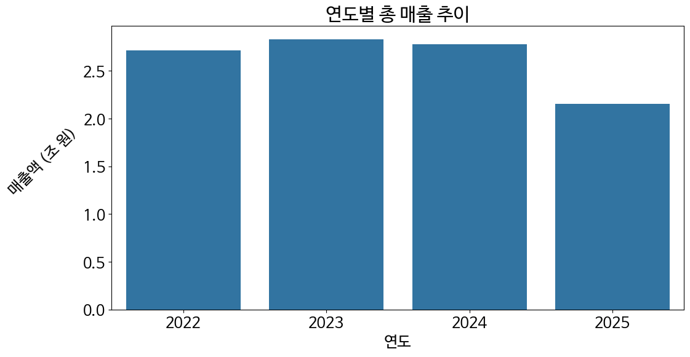

2025년의 데이터는 9개월 분이므로 12개월 분을 약 2조 X 약 1.33배 = 약 2.66조 라고 단순 추정했을 때 2022년 정도만큼은 나왔음을 알 수 있다.
- 2022년 -> 2023년 : 총 매출액 증가
- 2023년 -> 2025년 : 총 매출액 감소

```python
seasonal = df.groupby(['year', 'month'])['amt'].sum().reset_index()
seasonal['amt_100bil'] = seasonal['amt'] / 1e11 
pivot = seasonal.pivot(index='year', columns='month', values='amt_100bil')
plt.figure(figsize=(12, 6))
sns.heatmap(pivot, cmap='YlOrRd', xticklabels=[f'{m}월' for m in pivot.columns], yticklabels=[f'{y}년' for y in pivot.index])
plt.title('월별 매출 히트맵 (단위 : 천 억)')
plt.xlabel('월')
plt.ylabel('연도', rotation=0, labelpad=20) 
plt.yticks(fontsize=14, rotation=45, ha='right')
plt.show()
```
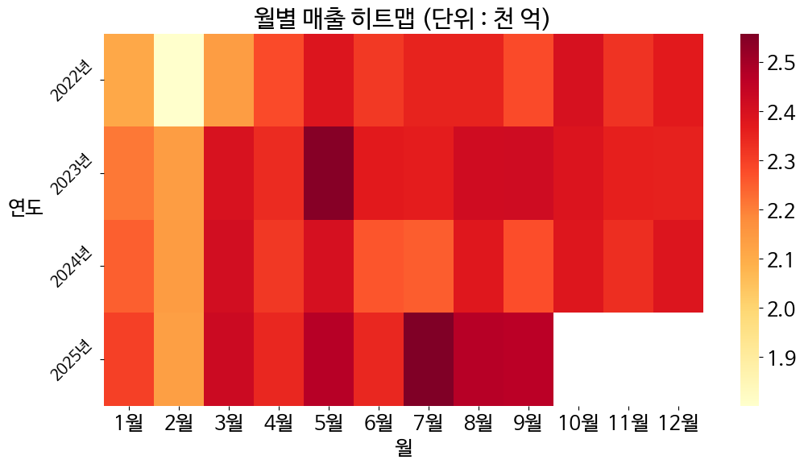

전반적으로 1 - 2월은 매출이 상대적으로 적고 5 - 9월은 매출이 상대적으로 높다. 2022년에는 펜데믹의 영향으로 4월 이후 매출이 평이한 것으로 보인다. 특이한 점은 2023년 5월, 2025년 7월에 매출이 두드러지게 높다는 사실이다. 

2023년 5월은 엔데믹이 선언된 시기여서 그 여파로 소비가 일시적으로 증가했다는 점을 알 수 있다. 2025년 7 - 9월은 민생회복 소비쿠폰이 지급된 시기로 모든 국민이 소비쿠폰을 받은 시기인 7월에 일시적으로 소비가 증가했음을 짐작할 수 있다.

```python
daily = df.groupby('day')[['amt', 'cnt']].sum()
daily = daily.reindex(day_order)
x = daily.index

daily['amt_tril'] = daily['amt'] / 1e12 
daily['cnt_mil'] = daily['cnt'] / 1e6  

fig, ax1 = plt.subplots(figsize=(10, 5))
ax1.plot(x, daily['amt_tril'], color='blue', marker='o', label='매출액')
ax1.set_xlabel('요일')
ax1.set_ylabel('매출액 (조 원)')
ax1.tick_params(axis='y', labelcolor='blue')

ax2 = ax1.twinx()
ax2.plot(x, daily['cnt_mil'], color='green', linestyle='--', marker='s', label='건수')
ax2.set_ylabel('결제 건수 (백만 건)')
ax2.tick_params(axis='y', labelcolor='green')

plt.title('요일별 매출 및 건수')
plt.grid(True, axis='y', alpha=0.3)
plt.tight_layout()
plt.show()
```
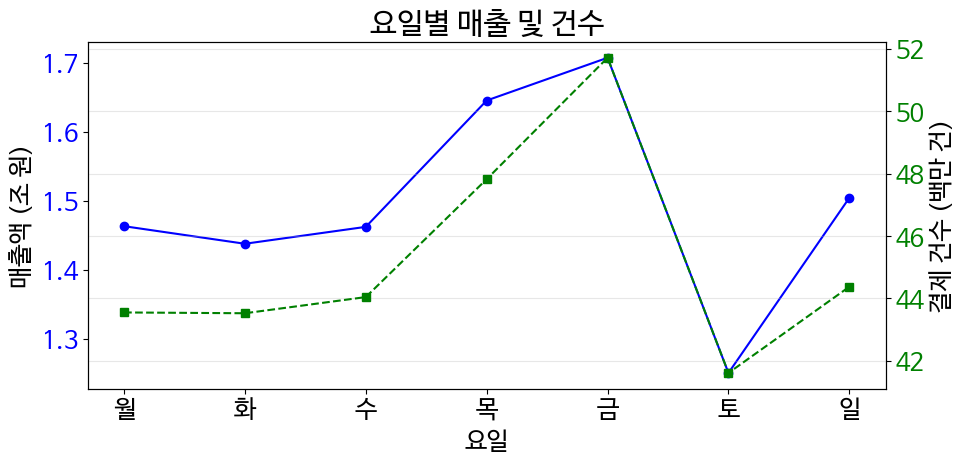

이 그래프를 보면 일요일 -> 금요일로 진행될 수록 점점 결제 건수와 매출액이 증가하는 모양이며 토요일이 되면 갑자기 줄어드는 모양을 하고 있다. 이것은 경기도 경제의 상당 부분을 차지하고 있는 수원시, 용인시, 화성시, 안산시 등에 위치한 대기업의 본사(삼성), 반도체·IT, 중공업·자동차·부품 공장들 (편의상 뒤에서는 공업 단지라고 부르겠다.) 위주의 경제 구조에 의한 것이다.

도시에서 일하는 노동자들에 의해 금요일 및 일요일 부근에 유동인구가 높을 것이라고 예측이 되며 이로 인해 토요일에 매출액 및 매출건수가 상대적으로 낮고 목요일, 금요일 부근에 매출액이 높을 것이라고 생각된다.

```python
hourly = df.groupby('hour')[['amt', 'cnt']].sum()
hourly = hourly.reindex(hour_order)
x = hourly.index

hourly['amt_tril'] = hourly['amt'] / 1e12 
hourly['cnt_mil'] = hourly['cnt'] / 1e6  

fig, ax1 = plt.subplots(figsize=(10, 5))
ax1.plot(x, hourly['amt_tril'], color='blue', marker='o', label='매출')
ax1.set_xlabel('시간대')
ax1.set_ylabel('매출액 (조 원)')
ax1.tick_params(axis='y', labelcolor='blue')

ax2 = ax1.twinx()
ax2.plot(x, hourly['cnt_mil'], color='green', linestyle='--', label='건수')
ax2.set_ylabel('결제 건수 (백만 건)')
ax2.tick_params(axis='y', labelcolor='green')

plt.title('시간대별 매출 및 건수')
plt.grid(True, axis='y', alpha=0.3)
plt.tight_layout()
plt.show()
```
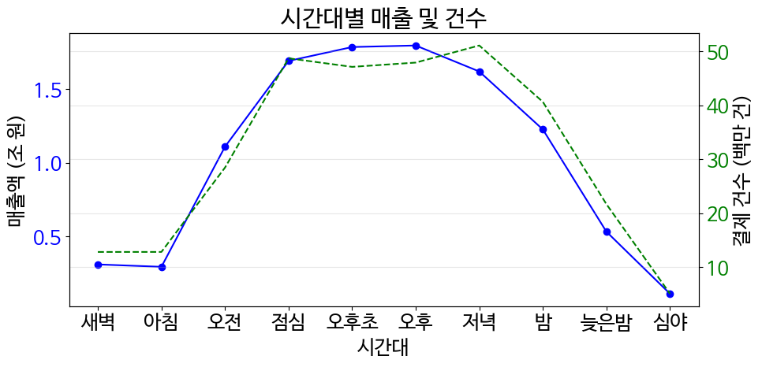

아침부터 서서히 증가해서 점심 ~ 저녁 까지 매출액과 결제 건수가 높고 저녁부터 서서히 감소하는 일반적인 도시에서 볼 수 있는 형태의 그래프를 하고 있다.

### 2. 인구통계적 분석
인구통계적 관점 분석은 현재의 인구를 기준으로 분석해야 적합하기에 2025년 데이터를 따로 불러온다.
```python
df_2025 = pd.read_csv('data/external/sampled_2025.csv', usecols=['age', 'sex', 'amt', 'cnt', 'card_tpbuz_cd'])
df_2025['age'] = df_2025['age'].map(age_map)
```
```python
sex_amt = df_2025.groupby('sex')['amt'].sum()
plt.pie(sex_amt, labels=sex_amt.index, autopct='%.1f%%')
plt.title('성별 매출 비중')
plt.show()
```


직장인, 가족 단위 인구가 많은 경기도의 특성을 반영하고 있다. 가족 전체를 위한 소비를 수입이 높은 가장 명의의 카드로 결제하는 경우도 있고, 가족의 외식이나 직장의 회식비 결제가 남성의 카드 위주로 이루어질 가능성이 크다는 것도 짐작해 볼 수 있다.

```python
age_amt = df_2025.groupby('age')['amt'].sum().reset_index()
age_amt['age'] = pd.Categorical(age_amt['age'], categories=age_order, ordered=True)
age_amt = age_amt.sort_values('age').reset_index(drop=True)

age_amt['amt_tril'] = age_amt['amt'] / 1e12 
plt.figure(figsize=(14, 8))
sns.barplot(data=age_amt, x='age', y='amt_tril')
plt.title('연령대별 매출')
plt.xlabel('연령대')
plt.ylabel('매출액 (조 원)', rotation=45, labelpad=40) 
plt.xticks(fontsize=14, rotation=45, ha='right')
plt.show()
```
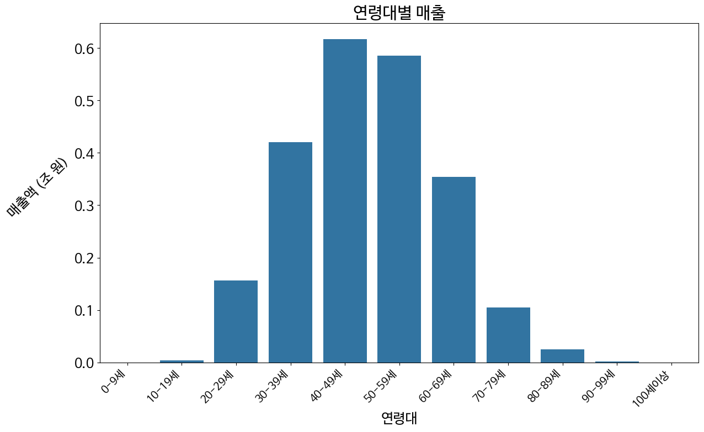

30 - 50대의 노동자 및 직장인 (또는 주부)들이 경기도 상권의 주 고객층임을 알 수 있다. 특이하게 50 - 60대의 매출액도 낮지 않음을 볼 수 있는데 이는 경기도에 가천대, 용인대, 아주대 등의 종합 대학교가 다수 있기 때문임을 짐작할 수 있다.

대학생들은 경제력이 대체로 낮으므로 구매력이 높지 않다고 생각할 수 있고, 종합 대학교의 교직원이나 종합 병원 환자들에 의해 다른 연령대에 비해 50 - 60대의 매출액이 낮지 않게 나온다고 생각된다.

다음 그래프에서 이상 데이터로 볼 수 있는 부분이 있어서 처리해 주었다.
```python
# S03(일반병원)에서 0 - 9세 유아가 2회에 걸쳐 총 2093042원 결제건이 단 한 건 있음.
kid_df = df_2025[df_2025['age'] == age_order[0]]
kid_df['객단가'] = kid_df['amt'] / kid_df['cnt']
kid_male = kid_df[kid_df['sex'] == 'M']

stats = kid_df.groupby('sex')['객단가'].agg(['mean', 'median', 'count'])
print(stats)

top_biz = kid_male.groupby('card_tpbuz_cd')['amt'].sum().nlargest(5)
print("매출 주도 업종:\n", top_biz)

top_trans = kid_male.nlargest(5, '객단가')
print("최고액 거래 내역:\n", top_trans)
```
```python
df_agg = df_2025.groupby(['age', 'sex'])[['amt', 'cnt']].sum().reset_index()
df_agg['객단가'] = df_agg['amt'] / df_agg['cnt']
mask_outlier = (df_agg['age'] == age_order[0]) & (df_agg['amt'] / df_agg['cnt'] >= 50000)

df_clean = df_agg[~mask_outlier].copy()
df_clean['age'] = pd.Categorical(df_clean['age'], categories=age_order, ordered=True)
df_clean = df_clean.sort_values('age').reset_index(drop=True)

# 그래프 그리기
plt.figure(figsize=(12, 6))
sns.lineplot(data=df_clean, x='age', y='객단가', hue='sex')
plt.title('연령/성별 객단가 추이')
plt.xticks(fontsize=14, rotation=45, ha='right')
plt.xlabel('연령대', fontsize=16)
plt.ylabel('객단가', fontsize=16, rotation=45, labelpad=20)
plt.show()
```
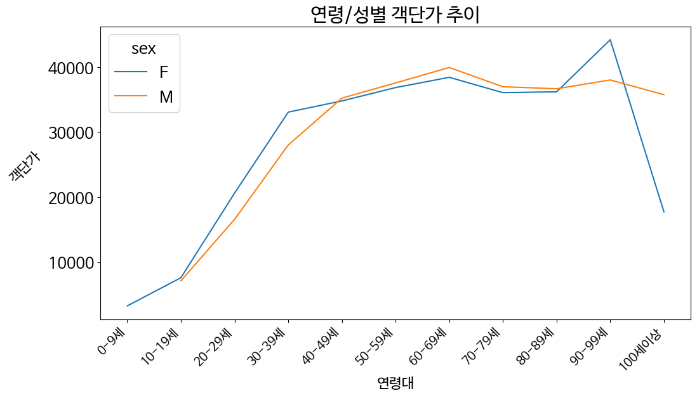

남성과 여성의 객단가 자체는 크게 차이나지 않음을 알 수 있다.

### 3. 카테고리 분석

```python
# 여기부터는 다시 전체 기간 데이터 사용
amt_top10 = df.groupby('card_tpbuz_cd', observed=True)['amt'].sum().nlargest(10).reset_index()
amt_top10['card_tpbuz_cd'] = amt_top10['card_tpbuz_cd'].astype(str)
amt_top10['amt_tril'] = amt_top10['amt'] / 1e12 

plt.figure(figsize=(14, 8))
sns.barplot(data=amt_top10, x='amt_tril', y='card_tpbuz_cd', palette='viridis')
plt.title('매출 상위 10개 업종')
plt.xlabel('총 매출액 (조 원)')
plt.ylabel('업종 코드', rotation=45, labelpad=30)
plt.show()
```


- D11 : 종합소매점
- F09 : 연료판매
- S03 : 일반병원
- D19 : 제조/도매
- Q15 : 한식
- D08 : 음/식료품소매
- F10 : 차량관리/서비스
- S02 : 의약/의료품
- D09 : 의복/의류
- S04 : 특화병원
  
상위 10개 업종이 대부분 의식주 및 필수 소비 위주임을 알 수 있지만 특이한 점은 연료판매, 차량관리가 높다는 점과 일반병원, 의약/의료품, 특화병원이 높다는 점이다.

연료판매, 차량관리는 경기도 지역 특성상 자가용으로 출퇴근 하는 사람들이 많기 때문임을 알 수 있고, 일반병원, 의약/의료품, 특화병원이 높은 것은 고령화가 진행됨에 따라 의료비 지출이 가계 경제의 핵심 부담이 되고 있음을 보여준다.

```python
cnt_top10 = df.groupby('card_tpbuz_cd', observed=True)['cnt'].sum().nlargest(10).reset_index()
cnt_top10['card_tpbuz_cd'] = cnt_top10['card_tpbuz_cd'].astype(str)
cnt_top10['cnt_10mil'] = cnt_top10['cnt'] / 1e7 


plt.figure(figsize=(14, 8))
sns.barplot(data=cnt_top10, x='cnt_10mil', y='card_tpbuz_cd', palette='magma')
plt.title('결제 빈도 상위 10개 업종')
plt.xlabel('총 결제 건수 (천만 건)')
plt.ylabel('업종 코드', rotation=45, labelpad=30)
plt.show()
```
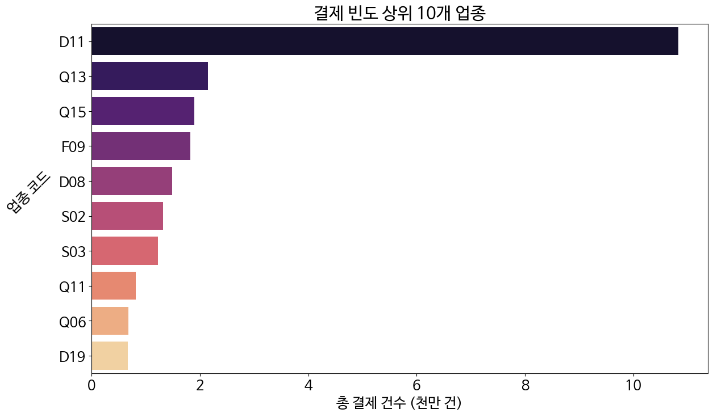

- D11 : 종합소매점
- Q13 : 커피/음료
- Q15 : 한식
- F09 : 연료판매
- D08 : 음/식료품소매
- S02 : 의약/의료품
- S03 : 일반병원
- Q11 : 제과/제빵/떡/케익
- Q06 : 분식
- D19 : 제조/도매

매출 상위권에는 없던 커피 / 간식류 업종이 빈도 상위권에 진입한 것은 한국인에게 커피가 매일 마시는 필수 요소가 되었음을 보여주며 식사를 간단하게 해결하거나, 빵으로 대체하는 식습관, 그리고 디저트 문화가 보편화되었음을 짐작하게 해준다. 

이는 종합소매점, 음/식료품소매가 순위권에 있음에서도 짐작할 수 있다. 사람들이 조금씩 자주 구매하고 있고 편의점이나 간단한 식사거리로 끼니를 해결하고 있음을 보여준다.

한국인의 평균적인 소비 루틴이 그대로 반영된 결과임을 알 수 있다.

```python
biz_stats = df.groupby('card_tpbuz_cd', observed=True).agg(total_amt=('amt', 'sum'),total_cnt=('cnt', 'sum')).reset_index()
biz_stats['avg_price'] = biz_stats['total_amt'] / biz_stats['total_cnt']
top_30_biz = biz_stats.nlargest(30, 'total_amt')
top_30_biz['amt_tril'] = top_30_biz['total_amt'] / 1e12 
top_30_biz['cnt_10mil'] = top_30_biz['total_cnt'] / 1e7

# 그래프를 시각적으로 개선하기 위해 brokenaxes 라이브러리를 사용
# https://github.com/bendichter/brokenaxes

# 축을 생략해서 빈 공간을 줄임.
from brokenaxes import brokenaxes

fig = plt.figure(figsize=(14, 8))

# brokenaxes 객체가 matplotlib의 객체와 호환이 잘 되지 않아서 자체 메서드 사용.
bax = brokenaxes(
    xlims=((-0.1, 2.7), (10.3, 11)), 
    ylims=((-30000, 340000), (760000, 870000)),
    hspace=0.05, wspace=0.05,
    despine=False
)

unique_cats = top_30_biz['card_tpbuz_cd'].unique()
colors = sns.color_palette('tab20', len(unique_cats))
color_map = dict(zip(unique_cats, colors))

for _, row in top_30_biz.iterrows():
    bax.scatter(
        x=row['cnt_10mil'], 
        y=row['avg_price'], 
        s=row['amt_tril'] * 1000,
        color=color_map[row['card_tpbuz_cd']],
        alpha=0.7,
        edgecolor='black',
        linewidth=0.5
    )
    
    bax.text(
        x=row['cnt_10mil'], 
        y=row['avg_price'], 
        s=row['card_tpbuz_cd'],
        fontsize=7,
        ha='center', 
        va='bottom'
    )

bax.set_xlabel('방문 빈도 (천만 건)', fontsize=16, labelpad=30)
bax.set_ylabel('객단가 (원)', fontsize=16, labelpad=100, rotation=45)
bax.grid(True, alpha=0.3, linestyle='--')
bax.set_title('업종별 포지셔닝 맵', fontsize=20)

plt.show()
```
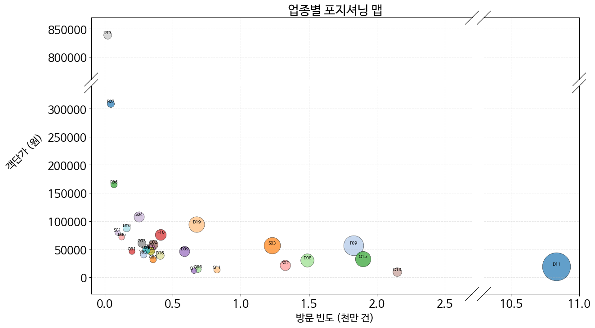

- 종합소매점(D11) : 빈도 높음, 매출 낮음
- 차량판매(D13) : 빈도 낮음, 매출 높음

경기도가 공업 단지로서의 기능과 배드 타운으로서의 기능을 동시에 하고 있음을 보여준다. 접근성 좋은 편의점/마트 빈도 높고 광역 출퇴근을 위한 자가용 보유 수요가 높다. 

서울 등 외부로 출퇴근하는 인구가 많아 퇴근 후/주말에 집 근처에서 생필품을 구매하는 활동이 많다. 동탄, 수지, 광교 등 대규모 신도시의 존재가 종합소매점의 높은 빈도를 뒷받침한다. 

자동차의 객단가가 높은 것으로 상대적으로 고가인 자동차를 구매할 수 있는 중산층 가구가 많음을 알 수 있다. 

차량판매의 객단가가 850000 정도인게 말이 되나 싶지만 차량판매 데이터는 리스/할부를 통한 구매 등 모든 케이스를 포함하고 있기 때문에 해당 수치가 나올 수 있다. 

또한, 이것은 추측이지만 경기도의 기업/공장에서 운용하는 법인 차량의 차량 수리비나 부품 대금 등의 건당 결제액이 850000일 수도 있다. 법인 카드는 건당 결제 한도가 정해져 있기 때문이다.

```python
top_5_names = amt_top10['card_tpbuz_cd'][:5]
subset = df[df['card_tpbuz_cd'].isin(top_5_names)]

subset['amt_tril'] = subset['amt'] / 1e12 

age_biz_pivot = subset.groupby(['card_tpbuz_cd', 'age'], observed=True)['amt_tril'].sum().unstack()
age_biz_pivot = age_biz_pivot.reindex(columns=age_order)

age_biz_ratio = age_biz_pivot.div(age_biz_pivot.sum(axis=1), axis=0) * 100
age_biz_ratio.plot(kind='barh', stacked=True, figsize=(12, 6), colormap='coolwarm')

plt.title('매출 Top 5 업종의 연령대별 고객 비중')
plt.xlabel('비중 (%)')
plt.ylabel('업종', rotation=0, labelpad=20)
plt.legend(title='연령대(Age)', bbox_to_anchor=(1.05, 1), loc='upper left')
plt.show()
```
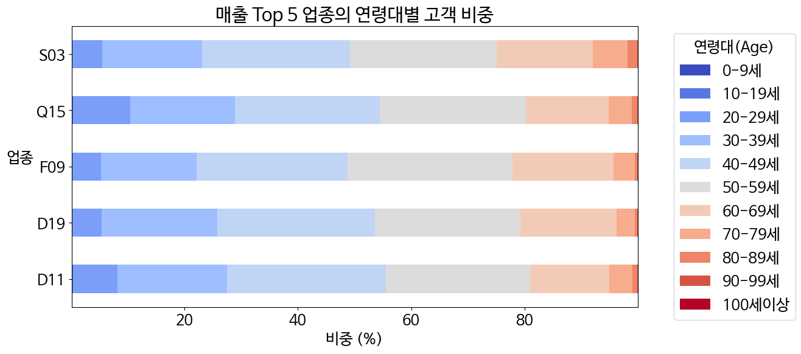

- D11 : 종합소매점
- F09 : 연료판매
- S03 : 일반병원
- D19 : 제조/도매
- Q15 : 한식

대부분 30 - 50대로 이루어져 있다. 30 - 50대가 가장 활발하게 경제활동을 하는 인구이며 자녀와 부모 모두를 부양하고 있는 부양의 주체가 되고 있음을 알 수 있다. 또한 경기도는 서울의 높은 집값을 피해 이주한 30 - 40대 부부와 자녀로 이루어진 핵가족이 대부분이므로 자연스러운 그래프이다.

### 4. 지역별 분석

```python
region_amt = df.groupby('city')['amt'].sum().nlargest(10).reset_index()
region_amt['city'] = region_amt['city'].astype(str)
region_amt['amt_tril'] = region_amt['amt'] / 1e12 

plt.figure(figsize=(14, 8))
sns.barplot(data=region_amt, x='city', y='amt_tril', palette='Blues_r')
plt.title('지역별 총 매출')
plt.xlabel('지역 코드')
plt.ylabel('총 매출액 (조 원)', rotation=45, labelpad=45)
plt.show()
```
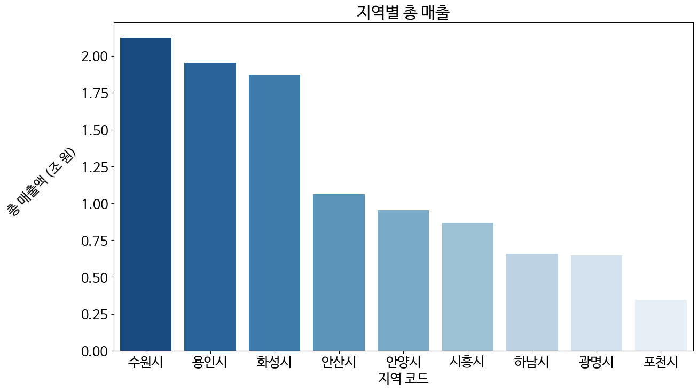

대규모 공업단지가 조성되어 있는 수원시, 용인시, 화성시 (그리고 안산시) 위주로 지역 경제가 활성화 되어 있다. 사람이 많이 몰리는 만큼 필연적으로 소비도 많이 나오게 됨을 알 수 있다.

```python
top_5_regions = region_amt['city'][:5]

top_5_biz = df.groupby('card_tpbuz_cd', observed=True)['amt'].sum().nlargest(5).index

subset = df[(df['city'].isin(top_5_regions)) & (df['card_tpbuz_cd'].isin(top_5_biz))]

subset['amt_100bil'] = subset['amt'] / 1e11 

pivot = subset.groupby(['city', 'card_tpbuz_cd'], observed=True)['amt_100bil'].sum().unstack()

plt.figure(figsize=(14, 8))
sns.heatmap(pivot, cmap='YlGnBu', annot=False)
plt.title('주요 지역별 업종 매출 히트맵 (단위 : 천 억)')
plt.xlabel('업종')
plt.ylabel('지역 코드', rotation=45, labelpad=30)
plt.show()
```
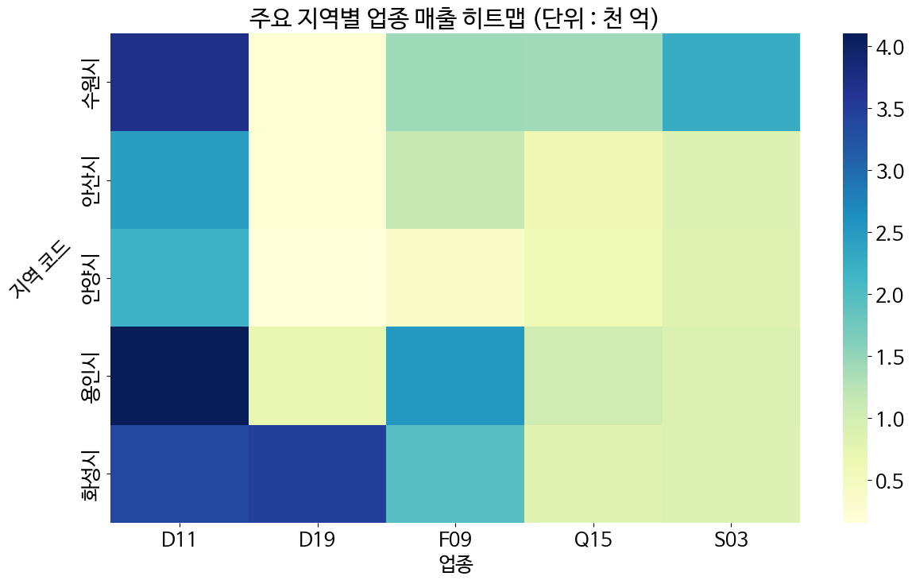

- D11 : 종합소매점
- D19 : 제조/도매
- F09 : 연료판매
- Q15 : 한식
- S03 : 일반병원

의식주 및 생필품등을 종합소매점에서 구매하고 있음을 짐작할 수 있고 공업단지 이외에도 다수의 신도시들이 서울, 인천 및 경기도의 타 지역으로 광역 출퇴근을 하는 사람들의 배드타운이 되고 있음을 알 수 있다.

```python
pivot_age = subset.groupby(['city', 'age'])['amt'].sum().unstack()
pivot_age = pivot_age.reindex(columns=age_order)
ratio_age = pivot_age.div(pivot_age.sum(axis=1), axis=0) * 100

ratio_age.plot(kind='bar', stacked=True, figsize=(14, 8), colormap='coolwarm')
plt.title('상위 5개 지역의 연령대별 매출 비중')
plt.xlabel('지역')
plt.ylabel('비중 (%)', rotation=45, labelpad=30)
plt.legend(title='연령대', bbox_to_anchor=(1.05, 1))
plt.xticks(fontsize=16, rotation=45, ha='right')
plt.show()
```
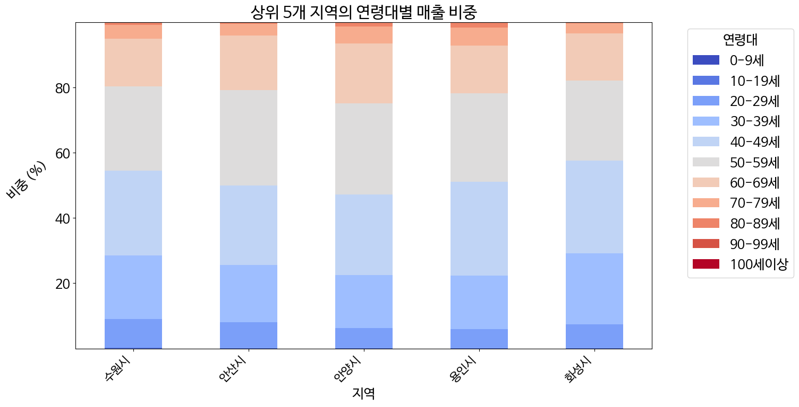

대부분 30 - 50대로 이루어져 있다. 위에서도 말했다시피 30~50대가 가장 활발하게 경제활동을 하는 인구이고 자녀와 부모 모두를 부양하고 있는 부양의 주체가 되고 있다. 또한 경기도는 서울의 높은 집값을 피해 이주한 핵가족들이 다수이며 광역 출퇴근을 하는 사람들의 배드타운의 역할을 하고 있으므로 경기도의 지역 특성상 자연스러운 그래프이다.

### 5. 복합 상관관계 분석

```python
pivot_time = df.groupby(['day', 'hour'])['amt'].sum().unstack()
pivot_time = pivot_time.reindex(day_order)
pivot_time = pivot_time.reindex(columns=hour_order)
pivot_time = pivot_time / 1e11 

plt.figure(figsize=(12, 6))
sns.heatmap(pivot_time, cmap='RdPu', annot=False)
plt.title('요일 및 시간대별 매출 집중도 (단위 : 천 억)')
plt.xlabel('시간대')
plt.ylabel('요일', rotation=0, labelpad=20)
plt.yticks(rotation=0)
plt.show()
```
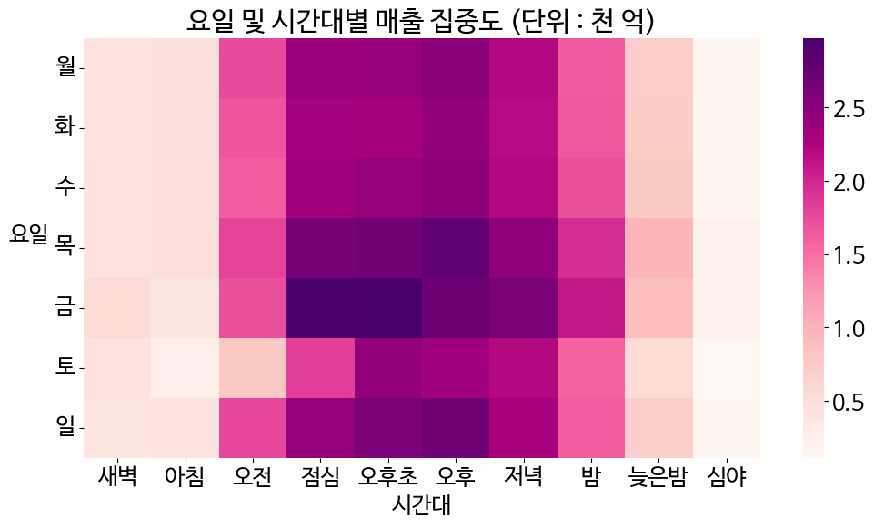

목 - 금요일, 점심 - 저녁 사이가 가장 매출이 집중되는 시기임을 알 수 있다. 월 - 목 사이에는 오후 - 저녁 사이의 매출이 두드러진다. 경기도의 기업, 반도체·IT R&D, 중공업·자동차·부품 공장 등에서 근무를 마친 대규모 근로자 집단이 밀집되는 시기일 것이라는 가정이면 아래와 같은 추측이 가능해진다.

 - 목, 금 점심: 팀 회식, 송별·환영 모임, 외부 미팅

 - 목, 금 저녁: 회식, 동료·지인과의 약속, 주말 장보기(대형마트, 종합소매점)
  
또한 광역 출퇴근을 하는 인윈이 많은 것으로 미루어 보아 아래와 같은 추측도 가능해진다.

 - 퇴근 후 서울 도심지에서 1차 소비 후 경기도의 역세권 및 신도시 상권에서 2차 소비
  
이러한 추측이면 종합소매점과 한식이 높은 비중을 차지하는 이유도 충분히 설명이 될 수 있다. 평일 낮 소비가 강한 서울 중심 업무지구에 비해 경기도는 퇴근 이후에 주거지 인근 상권으로 소비가 집중되며 목, 금 점심 - 저녁에는 근로자들의 소비까지 겹쳐서 소비가 최대가 된다. 

```python
age_hour = df.groupby(['age', 'hour'])['amt'].sum().reset_index()
age_hour['age'] = pd.Categorical(age_hour['age'], categories=age_order, ordered=True)
age_hour['hour'] = pd.Categorical(age_hour['hour'], categories=hour_order, ordered=True)
age_hour = age_hour.sort_values('age').reset_index(drop=True)
age_hour = age_hour.sort_values('hour').reset_index(drop=True)


plt.figure(figsize=(14, 8))
sns.lineplot(data=age_hour, x='hour', y='amt', hue='age', palette='turbo', linewidth=2)
plt.title('연령대별 시간대 소비 패턴 비교')
plt.xlabel('시간 (Hour)')
plt.ylabel('매출 규모')
plt.legend(bbox_to_anchor=(1.05, 1), title='나이대')
plt.show()
```
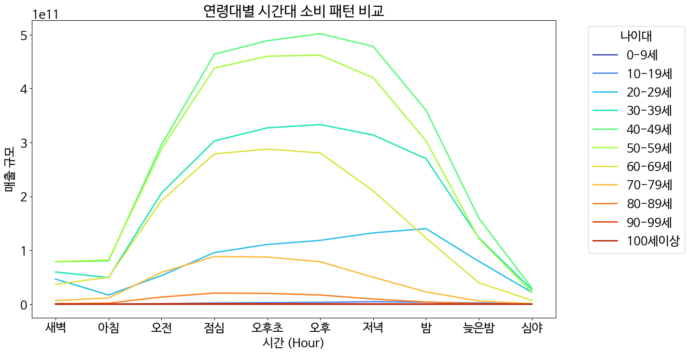

이 그래프는 이전의 설명을 뒷받침해 줄 수 있는 그래프이다. 그래프를 보면 30 - 60대 위주로 점심 - 저녁에 소비가 활발한 것을 알 수 있다. 경기도는 직장인, 가족 단위 인구가 지역 경제를 실질적으로 책임지고 있다.

```python
city_day = subset.groupby(['city', 'day'])['amt'].sum().reset_index()
city_day['day'] = pd.Categorical(city_day['day'], categories=day_order, ordered=True)
city_day = city_day.sort_values('day')
city_day['amt_scaled'] = city_day['amt'] / 1e11

plt.figure(figsize=(12, 6))
sns.barplot(data=city_day, x='day', y='amt_scaled', hue='city', palette='pastel')
plt.title('도시별 요일별 매출 규모 (단위 : 천 억)')
plt.ylabel('매출액')
plt.legend(title='도시', bbox_to_anchor=(1.05, 1), loc='upper left')
plt.show()
```
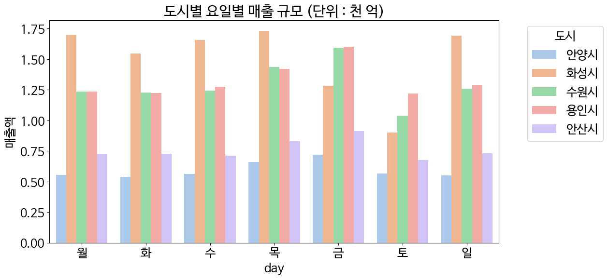

이 그래프 역시 이전의 설명을 뒷받침해 줄 수 있는 그래프이다. 도시에서 일하는 노동자들에 의해 금요일 및 일요일 부근에 유동인구가 높을 것이라고 예측이 되며 이로 인해 토요일에 매출액 및 매출건수가 상대적으로 낮고 목요일, 금요일 부근에 매출액이 높을 것이라고 생각된다.

```python
top_15_biz = df.groupby('card_tpbuz_cd', observed=True)['amt'].sum().nlargest(15).index
subset_sex = df[df['card_tpbuz_cd'].isin(top_15_biz)]

sex_biz = subset_sex.groupby(['card_tpbuz_cd', 'sex'], observed=True)['amt'].sum().unstack()
sex_biz['male_ratio'] = sex_biz['M'] / (sex_biz['M'] + sex_biz['F']) * 100
sex_biz = sex_biz.sort_values('male_ratio')

plt.figure(figsize=(10, 8))
plt.axvline(50, color='black', linestyle='--', alpha=0.5)
colors = ['blue' if x > 50 else 'red' for x in sex_biz['male_ratio']]
plt.barh(sex_biz.index, sex_biz['male_ratio'], color=colors, alpha=0.7)

plt.title('업종별 남성 매출 비중 (%)')
plt.xlabel('남성 매출 비중 (%)')
plt.xlim(0, 100)
plt.show()
```
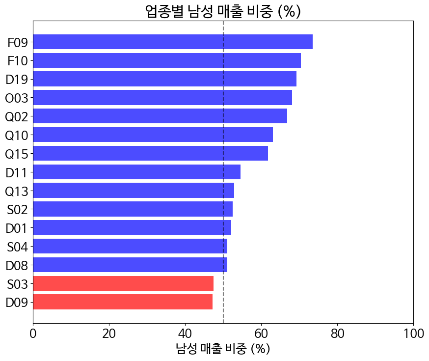

상위 매출 15개 업종에서 일반병원(S03), 의복/의류(D09)를 제외하고 모든 업종이 남성대상 매출이 많다. 이는 직장인, 가족 단위 인구가 많은 경기도의 특성을 반영하고 있다. 겉보기엔 남성이 쓴 것 같지만 가족 전체를 위한 소비를 수입이 높은 가장 명의의 카드로 결제하는 경우도 있다. 가족의 외식이나 직장의 회식비 결제가 남성의 카드 위주로 이루어질 가능성이 크다는 것도 짐작해 볼 수 있다. 또한 자녀 및 부모의 병원 방문이나 개인의 취향이 반영된 의복/의류는 대부분 여성이 소비결정권을 가지고 있음을 알 수 있다. 

## 5. 결론

### 1. 경기도의 정체성
데이터는 경기도가 단순한 서울의 위성도시를 넘어, 자급자족 가능한 산업 생태계와 대규모 주거 기능이 결합된 복합 경제권임을 보여주고 있다.


 - 산업 도시: 수원(삼성), 화성/안산(제조/부품), 용인(반도체) 등 핵심 산업 도시들의 매출 규모가 압도적이며, 이는 평일(목/금) 점심~저녁 시간대의 폭발적인 소비 피크로 이어짐.


 - 베드타운: 종합소매점의 압도적인 결제 빈도와 일요일 매출 회복 패턴은 퇴근 후와 주말에 지역 상권에서 생활 소비를 해결하는 특성이 반영됨.
  
### 2. 광역 출퇴근을 하는 3050세대


경기도 소비 시장을 움직이는 핵심 주체는 '자가용으로 출퇴근하며 가족을 부양하는 30~50대 남성 가장'으로 정의된다. 연료판매와 차량관리 업종의 높은 매출은 자가용이 경기도민의 생존 필수품임을 여실히 보여준다.
 


 - 남성 카드의 높은 매출 비중은 가장이 가족 전체의 생활비를 결제하는 일종의 '대리인' 역할을 수행하고 있음을 시사한다. 이는 경기도는 가족 중심의 생활 패턴이 강함을 보여준다. 
  
 - 병원과 의류 소비에서 나타난 여성의 주도권은 가구 내 돌봄과 취향 소비의 결정권이 분리되어 있음을 보여준다.

### 3. 실용·생존 그리고 효율


화려한 과시적 소비보다는 삶을 유지하고 효율화하는 실용적 소비가 경기도의 특징이다. 최근에 YONO(You Only Need One) 트랜드와 가치 소비 트랜드가 대두되고 있는 것도 어느정도 영향이 있다. 고물가·고금리 시대에 외화 가격까지 증가하면서 보여지는 경제 지표는 좋아지고 있는 반면 서민들의 생활은 점점 어려워 지고 있다. 


매출 상위 10개 업종 분석 결과, 백화점/명품/레저 등 과시적 소비재는 순위권 밖으로 밀려나고, 종합소매점(1위), 식료품(6위), 병원(3위) 등 생존 필수재가 상위권을 독식하고 있다. 이는 경기도민들이 경제적 불확실성에 대응하여 지출의 우선순위를 삶의 질에서 삶의 유지로 재조정했음을 보여준다.

### 4. 밥보다 커피, 외식보다 편의점


무조건 안 쓰는 것이 아니라 가성비를 극대화하거나 가심비(가격 대비 심리적 만족감)을 주는 특정 항목에는 아끼지 않는 선택과 집중 소비가 나타난다. 


 - 가성비(편의점): 종합소매점의 압도적 1위는 런치플레이션의 단면을 보여주기도 한다.
  
 - 가심비(커피): 반면 커피/음료가 빈도 2위를 차지한 것은, 밥값은 아껴도 커피 한 잔의 여유라는 작은 사치는 포기하지 않는 현대인의 이중적인 소비 심리를 대변한다. 이는 YONO 트렌드 속에서도 나를 위한 최소한의 보상은 유지하려는 성향과 일치한다.
  
### 5. 시사점
분석 결과를 바탕으로 경기도 상권 및 정책 수립, 마케팅 등에 있어 다음과 같은 방향성이 있을 것임을 짐작해본다.

 - 골든타임 공략: 마케팅과 상권 전략은 직장인들의 지갑이 열리는 목·금요일 점심과 퇴근 직후에 화력이 집중되어야 한다.

 - 가족 단위 타겟팅: 결제는 남성이 하더라도 실제 수혜자는 가족 전체인 경우가 많으므로, 가족의 편의와 건강을 소구점으로 하는 마케팅 전략이 대두될 것이다.

 - 원스톱 생활 거점화: 장보기, 식사, 서비스를 한 곳에서 해결할 수 있는 복합 편의 상권이 많이 조성될 것이다.

 - 생활비 절감 & 지속 가능성 지원: 경기도에서 곧 지역화폐 사용 시 추가 캐시백을 제공하는 것이 없어질 예정이라고 하는데 예산을 더 투입하는 등의 방안으로 이를 계속 유지할 것이다.

 - 실패 없는 선택 제안 : 기본 기능의 우수성, 가성비 용량등을 강조한 마케팅이 많아질 것이며 디저트나 커피등의 작은 사치 상품을 미끼 상품으로 활용하는 마케팅이 많아질 것이다.